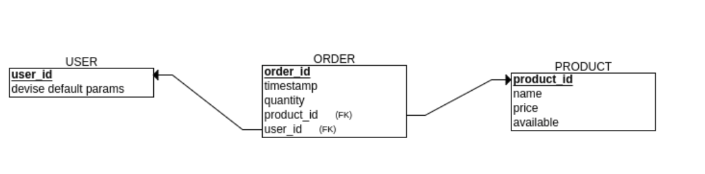

# Cuchi-orders

## Objetivo:

Satisfacer el hambre de media mañana de los Codeablers con sanguches de carretilla.

## Características mínimas:

### Usuarios

- Ofrecer una interfaz sencilla y amigable para que el usuario pueda separar sus sanguches para el día siguiente.

- Presentar al usuario una lista de los productos disponibles.

- Presentar al usuario una lista de los productos que solicitó en el día.

- Proteger la información de contacto de los usuarios.

### Admin

- Interfaz sencilla para actualizar la tabla de productos.

- Interfaz para ver la lista total de productos requeridos del día.

- Interfaz para ver la lista de productos según usuarios del día.

- Exportar los datos de pedidos para análisis.

### E/R Diagram

### Migrations

rails g devise:install
rails g devise user
rails g model Product name:string price:integer available:boolean
rails g model Order quantity:integer user:references product:references
